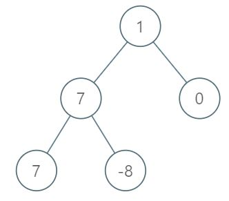

# 1161. Maximum Level Sum of a Binary Tree
Q: Given the root of a binary tree, the level of its root is 1, the level of its children is 2, and so on.

Return the smallest level X such that the sum of all the values of nodes at level X is maximal.

 

Example 1:\


```
Input: [1,7,0,7,-8,null,null]
Output: 2
Explanation: 
Level 1 sum = 1.
Level 2 sum = 7 + 0 = 7.
Level 3 sum = 7 + -8 = -1.
So we return the level with the maximum sum which is level 2.
``` 

Note:

1. The number of nodes in the given tree is between 1 and 10^4.
2. -10^5 <= node.val <= 10^5

## Answer
如果會解 102 題的話，這題應該也做得出來\
Jeff's 首刷\
Runtime: 336 ms, faster than 92.63% of Python
```python
# Definition for a binary tree node.
# class TreeNode(object):
#     def __init__(self, val=0, left=None, right=None):
#         self.val = val
#         self.left = left
#         self.right = right
class Solution(object):
    def maxLevelSum(self, root):
        """
        :type root: TreeNode
        :rtype: int
        """
        nodes = [root]
        currLevel = [0, -float("inf")]
        maxLevel = currLevel[0:]
        while nodes:
            currLevel[0] += 1
            currLevel[1] = sum(node.val for node in nodes)
            if maxLevel[1] < currLevel[1]:
                maxLevel = currLevel[0:]
    
            nodes = [n for node in nodes for n in (node.left, node.right) if n != None]
        return maxLevel[0]
```

另一個高手DFS解:
```python
from collections import defaultdict
# Definition for a binary tree node.
# class TreeNode(object):
#     def __init__(self, val=0, left=None, right=None):
#         self.val = val
#         self.left = left
#         self.right = right
class Solution(object):
    def maxLevelSum(self, root):
        """
        :type root: TreeNode
        :rtype: int
        """
        def inorder(node, level):
            if node:
                inorder(node.left, level + 1)
                level_sum[level] += node.val
                inorder(node.right, level + 1)
            
        level_sum = defaultdict(int)
        inorder(root, 1)
        return max(level_sum, key = level_sum.get)
```