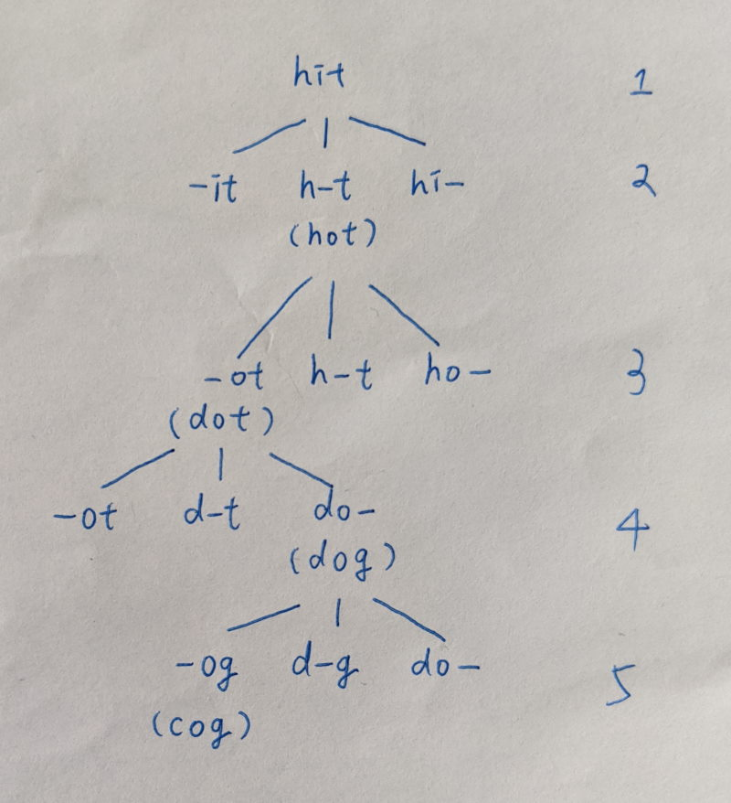

# 127. Word Ladder
Q: Given two words (beginWord and endWord), and a dictionary's word list, find the length of shortest transformation sequence from beginWord to endWord, such that:

Only one letter can be changed at a time.
Each transformed word must exist in the word list. Note that beginWord is not a transformed word.
Note:

Return 0 if there is no such transformation sequence.
All words have the same length.
All words contain only lowercase alphabetic characters.
You may assume no duplicates in the word list.
You may assume beginWord and endWord are non-empty and are not the same.
Example 1:
```
Input:
beginWord = "hit",
endWord = "cog",
wordList = ["hot","dot","dog","lot","log","cog"]

Output: 5
Explanation: As one shortest transformation is "hit" -> "hot" -> "dot" -> "dog" -> "cog",
return its length 5.
```
Example 2:
```
Input:
beginWord = "hit"
endWord = "cog"
wordList = ["hot","dot","dog","lot","log"]

Output: 0
Explanation: The endWord "cog" is not in wordList, therefore no possible transformation.
```

# Answer:
## 新解(效能較差但易懂)
來自論譠
https://leetcode.com/problems/word-ladder/solutions/1764371/a-very-highly-detailed-explanation/

```python (python3)
import queue
class Solution:
    def ladderLength(self, beginWord: str, endWord: str, wordList: List[str]) -> int:
        st = set(wordList)
        if endWord not in st:
            return 0

        q = queue.Queue()
        q.put(beginWord)

        visited = set()
        visited.add(beginWord)

        changes = 1

        while not q.empty():
            sz = q.qsize()
            for i in range(sz):
                word = q.get()
                if word == endWord:
                    return changes
                for j in range(len(word)):
                    for k in range(ord('a'), ord('z')+1):
                        word2 = word[:j] + chr(k) + word[j+1:]
                        if (word2 in st) and (word2 not in visited):
                            q.put(word2)
                            visited.add(word2)
            changes += 1
        return 0
```

## 初解
### 說明：
這題算是難題，就算一開始想出BFS的解法還不夠，前面有個前處理產生的data還要懂得運用才能讓BFS的效率達到最佳化，好家在Leetcode有提供它的詳解，但詳解還是有些地方沒講清楚，我會補充，這是第一種基本解法；另外詳解提供第二種更厲害的解法，要用到雙向BFS，目前這方法還沒仔細研究，所以只附上第一種基本解法。

首先需要先了解Leetcode詳解裡提到的intermediate word的概念，如果還有點忘記的話，[可以先回去看一下官方解(英版被拿掉了，故改放中文版)](https://leetcode.cn/problems/word-ladder/solutions/473600/dan-ci-jie-long-by-leetcode-solution/)，但有些地方它沒講清楚，我接下來會補充。

接下來我會將intermediate word用'-'來取代'*'，因為降在紙上寫下來比較容易，也不會被markdown辨識為特殊排版。



從上圖可以看出hit是如何經過intermediate word(簡稱iw)，最終到cog，但在code裡面，
為了避免route回到之前的iw造成cycle，我們會才做`all_combo_dict[intermediate_word] = []`，這可以簡單的證明為何要避免cycle，因為如果有cycle存在讓route找到目標字的話，必定也存在沒有cycle的route找到目標字，而這可以讓route最短(以graph來說是edges數；以樹來說是level數)。因為是用BFS來訪問每個字，每一層的iw都不會相同，只有到下一層以後才可能用到相同的iw造成cycle，所以`all_combo_dict[intermediate_word] = []`是讓我們將同一層訪問過的iw都標記為不再訪問，避免之後的層再回到cycle。

如此做基本上就可以通過了，但這code又加了個visited的判斷，是因為前面不能避免一種cycle，我在Leetcode討論區有回覆：
```
The visited essentially makes code faster here, not a pass-needed part. Take an example,
hot [h-t] hit [-it] git [g-t] got [-ot] hot (here I replace '*' with '-' ),
you can see hot cycles to hot again not through used intermediate words. So we can add hot to the visited for auxiliary cycle checks.
```
事實上這兩種cycle只要其中一種就可以pass了，因為都可以讓判斷收斂，只是如果兩個都加，code在龐大的特別資料上會跑更快，

### 複雜度分析：
以下原文部分皆取自Leetcode的解答
* Time Complexity: O(M×N), where M is the length of words and N is the total number of words in the input word list. Finding out all the transformations takes M iterations for each of the N words. Also, breadth first search in the worst case might go to each of the N words.

這裡時間複雜度O(MxN)的解釋沒有很清楚。請搭配上圖看，如果以worst case來說，這演算法會拜訪過每個word list的字，但在樹的呈現上(請搭配上圖)，除了根節點是初始字，其他每個有分支的節點都會是word list的其中一個字，而且因為沒有cycle，所以字不會有重覆(這是被visited變數擋掉了)。計算的次數剛好會是樹上的所有節點，而樹上除了根節點，其他每個有分支的節點因為是word list的其中一個字，總共會有 N 個，這些字會落在樹的第二層以後的每一層，每一層都會訪問過 M 個 intermediate words(字的長度為 M )，所以計算次數總共是 O(NxM)

* Space Complexity: O(M×N), to store all M transformations for each of the N words, in the all_combo_dict dictionary. Visited dictionary is of N size. Queue for BFS in worst case would need space for all N words.

### 程式碼：
```python
from collections import defaultdict
class Solution(object):
    def ladderLength(self, beginWord, endWord, wordList):
        """
        :type beginWord: str
        :type endWord: str
        :type wordList: List[str]
        :rtype: int
        """

        if endWord not in wordList or not endWord or not beginWord or not wordList:
            return 0

        # Since all words are of same length.
        L = len(beginWord)

        # Dictionary to hold combination of words that can be formed,
        # from any given word. By changing one letter at a time.
        all_combo_dict = defaultdict(list)
        for word in wordList:
            for i in range(L):
                # Key is the generic word
                # Value is a list of words which have the same intermediate generic word.
                all_combo_dict[word[:i] + "*" + word[i+1:]].append(word)


        # Queue for BFS
        queue = collections.deque([(beginWord, 1)])
        # Visited to make sure we don't repeat processing same word.
        visited = {beginWord}
        while queue:
            current_word, level = queue.popleft()      
            for i in range(L):
                # Intermediate words for current word
                intermediate_word = current_word[:i] + "*" + current_word[i+1:]

                # Next states are all the words which share the same intermediate state.
                for word in all_combo_dict[intermediate_word]:
                    # If at any point if we find what we are looking for
                    # i.e. the end word - we can return with the answer.
                    if word == endWord:
                        return level + 1
                    # Otherwise, add it to the BFS Queue. Also mark it visited
                    if word not in visited:
                        # prevent from cycle (method 1)
                        visited.add(word)
                        queue.append((word, level + 1))
                # prevent from cycle (method 2)
                all_combo_dict[intermediate_word] = []
        return 0
```