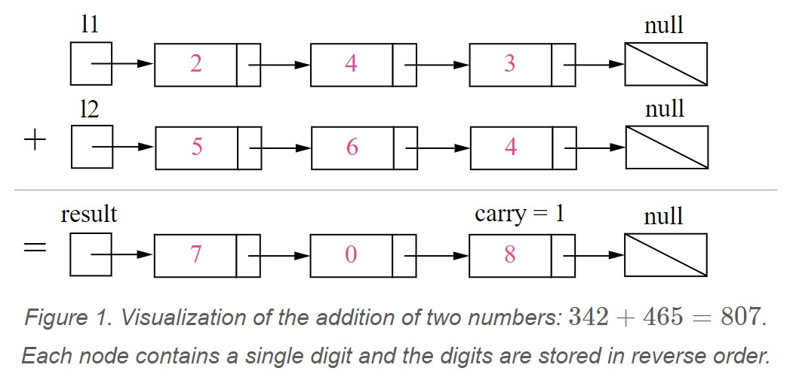

# 02. Add Two Numbers:
Q: You are given two non-empty linked lists representing two non-negative integers. The digits are stored in reverse order and each of their nodes contain a single digit. Add the two numbers and return it as a linked list.

You may assume the two numbers do not contain any leading zero, except the number 0 itself.

Example:
```
Input: (2 -> 4 -> 3) + (5 -> 6 -> 4)
Output: 7 -> 0 -> 8
Explanation: 342 + 465 = 807.
```

# Explain
這題是考大數相加，只要快速看懂下圖就能寫得出來


# Solution
Jeff's 3rd practice (Cleaner than before)

這次的練習有在時限內說明並解出，心境上要調整到正面積極及信心的狀態，就能消除不必要的緊張感，過程中也不要去理會周遭的雜訊。

這次的解法比之前都更乾淨，一開始本來寫起來滿累贅的，出現很多重覆code，但並不是亂寫，寫到後面開始有refactor作法的靈感，就開始重寫後變成下面精簡的code。

注意，題目的圖用箭頭將每個值連起來，看起來會以為是 Linked List的順序，其實不是！這是陷阱！當它寫`given two non-empty linked lists representing two non-negative integers`，就要推測 243 存的順序是 3->4->2
```python
# Definition for singly-linked list.
# class ListNode(object):
#     def __init__(self, val=0, next=None):
#         self.val = val
#         self.next = next
class Solution(object):
    def addTwoNumbers(self, l1, l2):
        """
        :type l1: ListNode
        :type l2: ListNode
        :rtype: ListNode
        """
        head = ListNode()
        node = head
        carry = 0
        digit = 0
        while l1 or l2 or carry > 0:
            
            sm = carry

            if l1:
                sm += l1.val
                l1 = l1.next
                
            if l2:
                sm += l2.val
                l2 = l2.next
                           
            digit = sm%10
            carry = sm/10
            
            node.next = ListNode(digit)
            node = node.next
            
        return head.next
```

kotlin version
```java kotlin
/**
 * Example:
 * var li = ListNode(5)
 * var v = li.`val`
 * Definition for singly-linked list.
 * class ListNode(var `val`: Int) {
 *     var next: ListNode? = null
 * }
 */
class Solution3 {
    fun addTwoNumbers(l1: ListNode?, l2: ListNode?): ListNode? {

        var digit = 0
        var carry = 0
        var head = ListNode(0)
        var node = head
        var l1 = l1
        var l2 = l2
        while(l1 != null || l2 != null || carry > 0) {

            var sm = carry
            if(l1 != null) {
                sm += l1.`val`
                l1 = l1.next
            }

            if(l2 != null) {
                sm += l2.`val`
                l2 = l2.next
            }

            digit = sm%10
            carry = sm/10

            node.next = ListNode(digit)
            node = node.next!!
        }

        return head.next
    }
}
```


Jeff's second practice
```python
# Definition for singly-linked list.
# class ListNode(object):
#     def __init__(self, val=0, next=None):
#         self.val = val
#         self.next = next
class Solution(object):
    def addTwoNumbers(self, l1, l2):
        """
        :type l1: ListNode
        :type l2: ListNode
        :rtype: ListNode
        """
        curr = ListNode(0)
        out = curr
        add = 0
        while True:
            c = 0
            if l1:
                c = l1.val
                l1 = l1.next
            if l2:
                c += l2.val
                l2 = l2.next
            if add > 0:
                c += add

            if c > 9:
                curr.val = c - 10
                add = 1
            else:
                curr.val = c
                add = 0
                
            if l1 or l2 or add > 0:
                curr.next = ListNode(0)
                curr = curr.next
            else:
                break
        
        return out
```

Jeff's answer
```python
# Definition for singly-linked list.
class ListNode(object):
    def __init__(self, x):
        self.val = x
        self.next = None

class Solution(object):
    def addTwoNumbers(self, l1, l2):
        """
        :type l1: ListNode
        :type l2: ListNode
        :rtype: ListNode
        """
        carry = 0
        lnow = ListNode(-1)
        lresult = lnow

        while (l1 is not None) or (l2 is not None) or carry != 0:
            
            v1, v2 = 0, 0
            if l1 is not None:
                v1 = l1.val
            if l2 is not None:
                v2 = l2.val

            v = v1 + v2 + carry
            carry = 0

            if v >= 10:
                carry = 1
                v -= 10

            lnow.next = ListNode(v)
            lnow = lnow.next

            if l1 != None:
                l1 = l1.next
            
            if l2 != None:
                l2 = l2.next

        lresult = lresult.next

        return lresult

l1 = ListNode(2)
l1.next = ListNode(4)
l1.next.next = ListNode(3)

l2 = ListNode(5)
l2.next = ListNode(6)
l2.next.next = ListNode(4)
s = Solution()
r = s.addTwoNumbers(l1, l2)
print r.val, r.next.val, r.next.next.val
```

## Relation
- Similar and easier : [[415_Add_Strings]]


#medium