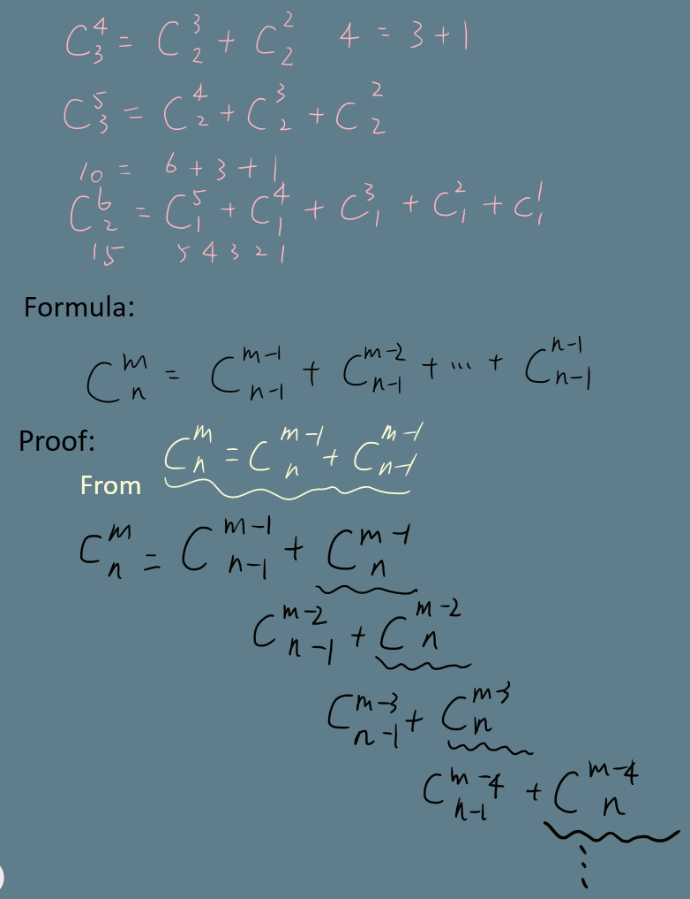

# 77. Combinations
Q: Given two integers n and k, return all possible combinations of k numbers out of 1 ... n.

You may return the answer in any order.

Example 1:
```
Input: n = 4, k = 2
Output:
[
  [2,4],
  [3,4],
  [2,3],
  [1,2],
  [1,3],
  [1,4],
]
```
Example 2:
```
Input: n = 1, k = 1
Output: [[1]]
```
Constraints:
* 1 <= n <= 20
* 1 <= k <= n

## Answer
Jeff看過高手解後的簡化解

概念一樣是高中學的分配組合法

* 這邊用的變數名稱滿妙的，可以學一下,
    * index: Used for the code clip, `for i in xrange(index,n)`. The i is an index at which we are going to pick an item from nums. 
    * pick: The number of picked characters
    * path: A composed string so far. 
```python
# Runtime: 72 ms, faster than 93.39% of Python online submissions for Combinations.
# Memory Usage: 14.9 MB, less than 53.13% of Python online submissions for Combinations.
class Solution(object):
    def combine(self, n, k):
        """
        :type n: int
        :type k: int
        :rtype: List[List[int]]
        """
        def dfs(index, pick, path):

            if pick == k:
                out.append(path)
                return

            for i in xrange(index,n):
                # 這個if case是用來加速用
                # k-pick代表還剩幾個數字要組合，i是取了pick個數後目前還可以拿取的位置，所以要減1
                if i-1+(k-pick) >= n:
                    break
                
                dfs(i+1, pick+1, path+[nums[i]])

        nums = xrange(1,n+1)
        out = []
        dfs(0, 0, [])
        
        return out
```

學習用 18. 4Sum 在遞迴裡的迭代寫法：
* 定義一個函式叫 comb(nums, k)，其中 nums 代表一個裡面沒重覆的陣列，k是選的數
* 在遞迴函式裡用 comb(nums[i+1:], k-1) 將答案縮小
* 注意 k==0 的狀態是回傳 `[[]]`
```python
# Runtime: 488 ms, faster than 76.29% of Python online submissions for Combinations.
# Memory Usage: 15.2 MB, less than 28.74% of Python online submissions for Combinations.
class Solution(object):
    def combine(self, n, k):
        """
        :type n: int
        :type k: int
        :rtype: List[List[int]]
        """
        def comb(nums, k):
            out = []
            if k == 0:
                return [[]]
            
            for i in xrange(len(nums)):
                for set in comb(nums[i+1:], k-1):                
                    out.append([nums[i]] + set)
                
            return out

        nums = list(xrange(1,n+1))
        return comb(nums, k)
```
番外數學篇：\
從上面程式發現數學公式並證明之\


解二:

從 78. Subsets 詳解中的 cascading 法修改而來
```python
# Runtime: 880 ms, faster than 6.78% of Python online submissions for Combinations.
# Memory Usage: 203.6 MB, less than 5.98% of Python online submissions for Combinations.
class Solution(object):
    def combine(self, n, k):
        """
        :type n: int
        :type k: int
        :rtype: List[List[int]]
        """
        nums = xrange(1, n+1)
        sets = [[]]
        output = []
        for num in nums:
            arr = [curr + [num] for curr in sets]
            sets += arr
            for a in arr:
                if len(a) == k:
                    # output.append(a)
                    output += [a]
            
        return output
```