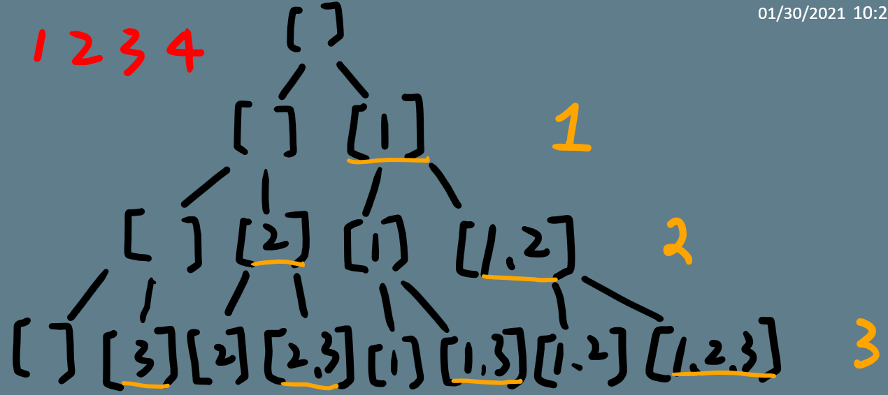

# 90. Subsets II
Q: Given a collection of integers that might contain duplicates, nums, return all possible subsets (the power set).

Note: The solution set must not contain duplicate subsets.

Example:
```
Input: [1,2,2]
Output:
[
  [2],
  [1],
  [1,2,2],
  [2,2],
  [1,2],
  []
]
```
## Answer
第 78. Subsets的延伸題，只要將 78. 的方法在最前面加上 nums.sort(必要) 跟用一個hash儲存用過的值，來判斷是否重覆(類似 47 Permutations II的解法)，就可輕鬆解出。

注意，這題一開始一定要先對nums做sort，否則會出現像下面測值的錯誤，可以發現[4,1]與[1,4]重覆；[4,4,1]也與[4,1,4]重覆；[4,4,4,1]也與[4,4,1,4]重覆；原因就是出在1後面的4被選了，就會跟先前4放在1前面的組合重覆了。
```
Input
[4,4,4,1,4]

Output
[[],[4],[1],[4,4],[4,1],[1,4],[4,4,4],[4,4,1],[4,1,4],[4,4,4,1],[4,4,4,4],[4,4,1,4],[4,4,4,1,4]]

Expected
[[],[1],[1,4],[1,4,4],[1,4,4,4],[1,4,4,4,4],[4],[4,4],[4,4,4],[4,4,4,4]]
```
python
```python
# Runtime: 24 ms, faster than 76.00% of Python online submissions for Subsets II.
# Memory Usage: 13.8 MB, less than 23.04% of Python online submissions for Subsets II.
class Solution(object):
    def subsetsWithDup(self, nums):
        """
        :type nums: List[int]
        :rtype: List[List[int]]
        """
        nums.sort()
        # nums.sort(key=lambda x: -x) // ascending or descending 皆可，只要有排序就好
        def dfs(index, pick, arr, n):
            if pick >= n:
                r.append(arr)
                return

            _set=set()
            for i in xrange(index, size):
                # 在77題當作加速用，但這似乎效用不大                
                # if i-1+n-pick >= size:
                #     break
                if nums[i] not in _set:
                    _set.add(nums[i])
                    dfs(i+1, pick+1, arr+[nums[i]], n)
                
        r=[]
        r.append([])
        size = len(nums)
        for i in xrange(1, size+1):
            dfs(0, 0, [], i)

        return r        
```

改寫上面的版本，拿掉set，將index移動到list中不重覆的位置才計算，類似15. 3Sum的作法，改寫後如下
```python
# Runtime: 24 ms, faster than 76.00% of Python online submissions for Subsets II.
# Memory Usage: 13.6 MB, less than 53.56% of Python online submissions for Subsets II.
class Solution(object):
    def subsetsWithDup(self, nums):
        """
        :type nums: List[int]
        :rtype: List[List[int]]
        """
        nums.sort()
        def dfs(index, pick, arr, n):
            if pick >= n:
                r.append(arr)
                return

            for i in xrange(index, size):
                # 在77題當作加速用，但這似乎效用不大                
                # if i-1+n-pick >= size:
                #     break
                if i>index and nums[i] == nums[i-1]: # 將index移動到 list中不重覆的位置才計算
                    continue
                dfs(i+1, pick+1, arr+[nums[i]], n)
                
        r=[]
        r.append([])
        size = len(nums)
        for i in xrange(1, size+1):
            dfs(0, 0, [], i)

        return r      
```

另外論譠有用iterative的解法，用到類似 15. 3sum 判斷重覆的方法，並改良了 78. Subsets 的 Cascading Approach，再參考下圖示意就懂code的邏輯了。

```python
class Solution:
    def subsetsWithDup(self, nums):
        if not nums:
            return []
        nums.sort()
        res, cur = [[]], []
        for i in range(len(nums)):
            if i > 0 and nums[i] == nums[i-1]:
                cur = [item + [nums[i]] for item in cur]
            else:
                cur = [item + [nums[i]] for item in res]
            res += cur
        return res
```

